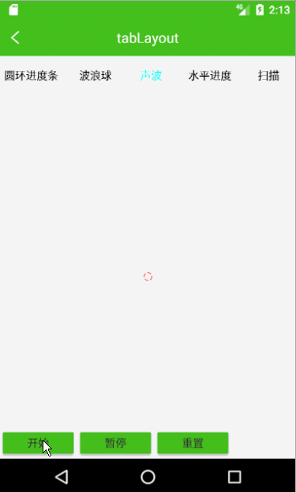

## 扫描框
  -------------
       

## 进度条
  -------------
              

## 声波效果
  -------------

## 通知小圆点
  -------------

## 悬浮窗
  -------------

# 自定义键盘
  -------------

# BarChart
条形图及加入动画，支持水平滑动
# 说明

1. 条目的宽度可以自行更改，我能给你的，只有思路和方法
2. 图表的滑动用到了Android的手势，处理起来还是比较复杂，可以学习学习哦

# 效果

1. 不可滑动。

2. 可滑动。

图片看起来有点失真，还伴随点卡顿，这是由于录像是电脑和手机连接不稳定造成的，真实的动画是不会有任何卡顿的。